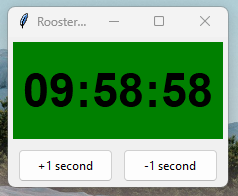

# Rooster Watch

**Rooster Watch** is a simple dynamic desktop clock application built with Python and Tkinter.

Rooster Watch was created to assist intraday traders working on the EPEX power exchange, where 15-minute contracts are actively traded.

In fast-paced trading environments, it is easy to lose track of time, especially during stressful periods with heavy workload.  
This simple clock application uses dynamic color changes to visually highlight key moments within the trading cycle, helping traders stay aware of time-sensitive trading windows.

This is one of the very first applications I have developed. It is not a large or complex app, but it helps to keep a trading account safe from imbalances during busy trading periods. 🙂

## Features
- Black digits on a color-changing background.
- +1 second and -1 second adjustment buttons.
- Background color changes at specific minutes and seconds:
  - Turns **red** at minutes 8, 23, 38, and 53 (starting at second 0).
  - Turns **dark purple** (indigo) at minutes 9, 24, 39, and 54 after 40 seconds.
  - Returns to **green** at minutes 10, 25, 40, and 55 (starting at second 0).
- Dynamic resizing of clock digits based on window size.
- Minimalistic and user-friendly window borders and layout.
- Lightweight and easy to run, requiring only standard Python libraries.

## Installation

1. Make sure you have **Python 3** installed on your system.
2. Clone this repository:

```bash
git clone https://github.com/ondrej-bajer/Rooster_watch.git

## 📸 Screenshots



